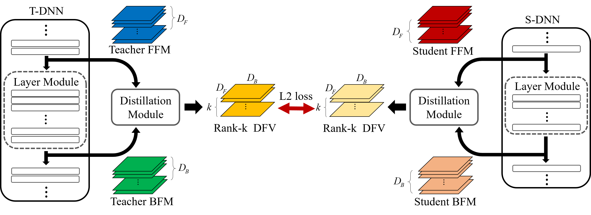
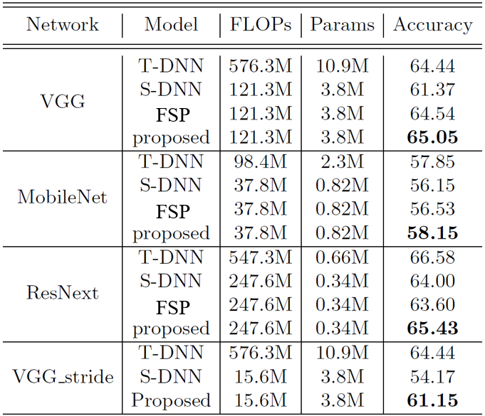

# Self-supervised Knowledge Distillation using Singular Value Decomposition

## Feature
- Define knowledge by Singular value decomposition
- Fast and efficient learning by multi-task learning
 
## Requirments
- Tensorflow
- Scipy

Unfortunatly SVD is very slow on GPU. so  recommend below installation method.
- Install Tensorflow from source which is removed SVD GPU op.(recommended)
- Install ordinary Tensorflow and make SVD using CPU.
- Install Tensorflow version former than 1.2.

## How to Use
The code is based on Tensorflow-slim example codes. so if you used that it is easy to understand.
( If you want recoded dataset and trained teacher weights download them on https://drive.google.com/open?id=1sNPkr-hOy3qKNUE8bu5qJpvCGFI7VOJN )
1. Recording Cifar100 dataset to tfrecording file 
2. Train teacher network by train_teacher.py, and you can find trained_param.mat in training path.
3. Train student network using teacher knowledge which trained step 2 or default knowledge which is ImageNet pretrained VGG16.

## Results

## Paper
This research accepted to ECCV2018 poster session
and arxiv version paper is available on https://arxiv.org/abs/1807.06819
and ECCV format paper is available on http://openaccess.thecvf.com/content_ECCV_2018/papers/SEUNG_HYUN_LEE_Self-supervised_Knowledge_Distillation_ECCV_2018_paper.pdf

